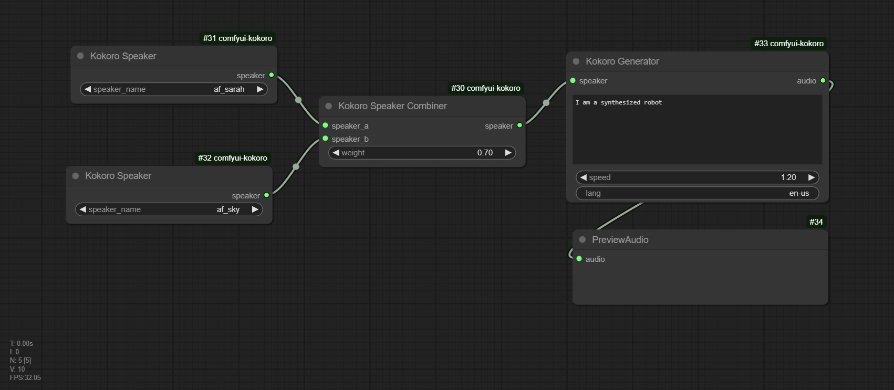
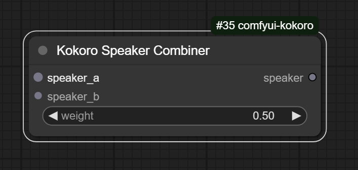
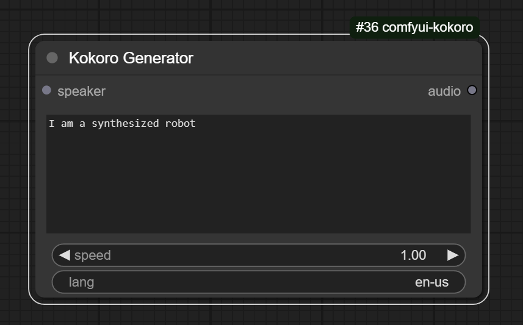
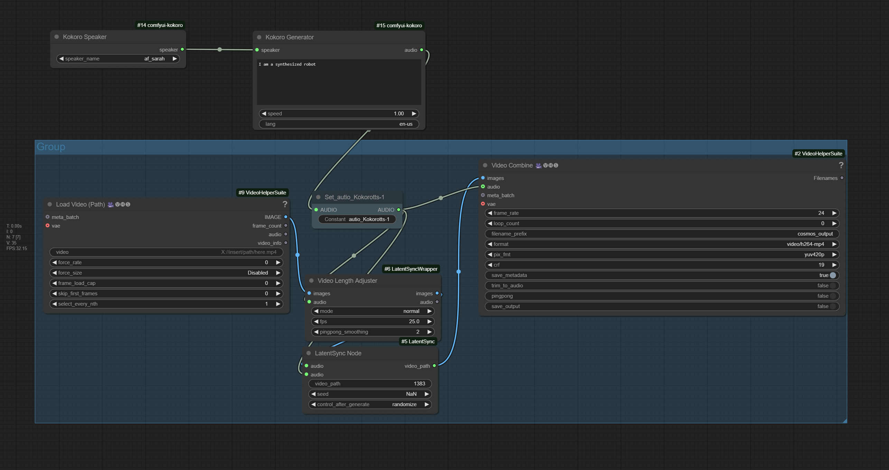

# Comfy UI Kokoro

<a href="https://www.buymeacoffee.com/stavsapq" target="_blank"></a>


Kokoro TTS nodes, based on this [kokoro repo](https://github.com/thewh1teagle/kokoro-onnx)



**note**: This picture is also a workflow, just download and drop it into comfy.

## Install

Install Via ComfyUI Manager

Or

Clone the repo into `custom_nodes` folder, and reboot Comfy.

```shell
git clone https://github.com/stavsap/comfyui-kokoro.git
```

Then cd into `comfyui-kokoro`, and install requirements.

```shell
pip install -r requirements.txt 
```


The model and speakers meta-data will be automatically downloaded on the first run.

## Nodes

Currently, there are 3 nodes that can be combined for TTS workflow.

### Kokoro Speaker


Select supported speakers.

### Kokoro Speaker Combiner



Combiner node to combine 2 given speakers to new speaker.

- **weight**: [1, 0], select the weight of `speaker a`.

Example:

`weight == 0.7` will result in strength of 70% of `speaker_a` and 30% of `speaker_b`.


### Kokoro Generate



- **speaker**: input a speaker
- **speed**: set the speach speed.
- **lang**: set the language, what ever is supported by kokoro.


## Available Voices

All supported voices can be found [here](https://huggingface.co/hexgrad/Kokoro-82M/blob/main/VOICES.md).

## Use Cases:

1. TTS: Text To Speach, generate voice from test.

2. Lip Sync: sync lips of videos



## License

- [This repo](LICENSE)
- kokoro-onnx: MIT
- kokoro model: Apache 2.0

## Credits

- [Kokoro TTS Engine](https://huggingface.co/hexgrad/Kokoro-82M)
- [ComfyUI](https://github.com/comfyanonymous/ComfyUI)
- [ComfyUI-BS_Kokoro-onnx](https://github.com/Burgstall-labs/ComfyUI-BS_Kokoro-onnx)
- [ComfyUI-KokoroTTS](https://github.com/benjiyaya/ComfyUI-KokoroTTS)
